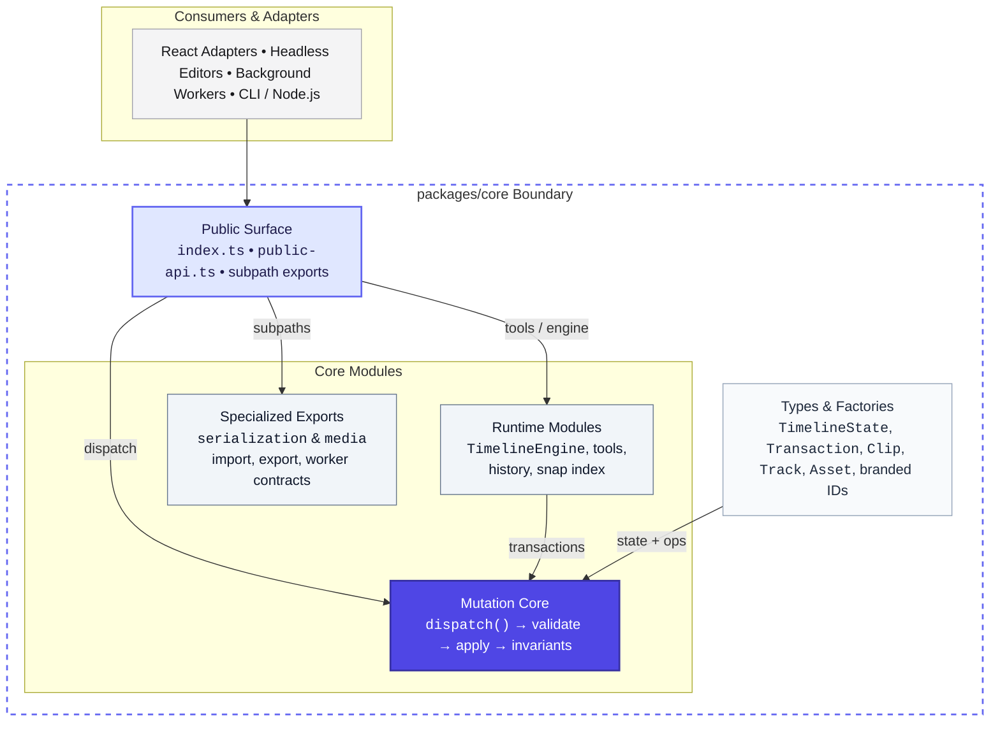

`@timelinx/core` is designed as a deterministic, framework-agnostic editing kernel. It stores timeline state in plain TypeScript data structures, accepts edit intent as transactions, validates operations against strict invariants, and returns a new immutable state. That separation allows the exact same kernel to power browser React editors, headless server processing, background workers, tests, and future collaboration backends.

The central rule: do not mutate tracks, clips, markers, or asset registries directly in application code. Build a `Transaction`, call `dispatch()`, and render the returned `nextState` only when the transaction is accepted.

## Architecture Diagram



## Architectural Layers

| Layer | Responsibility & Exports |
|-------|--------------------------|
| **Public Surface** | Single entry point (`index.ts`, `public-api.ts`, and subpath exports) exposing canonical functions and types while encapsulating internal state updates. |
| **Mutation Core** | Pure function pipeline: `dispatch(state, transaction)` validates rolling state, applies operations immutably, and runs full-document invariant checks before committing. |
| **Runtime Modules** | Editing tools (selection, razor, ripple, slip, etc.), `TimelineEngine` container, `HistoryStack` (undo/redo), and `SnapIndexManager`. |
| **Specialized Exports** | Non-UI domain contracts including `serialization` (JSON, OTIO, EDL, AAF, FCPXML) and `media` (WebCodecs/audio worker contracts). |
| **Types & Factories** | Canonical TypeScript types (`TimelineState`, `Timeline`, `Track`, `Clip`, `Asset`, `Transaction`) and branded ID constructors (`toFrame`, `toTrackId`, etc.). |

The package boundary is intentionally narrow. `core` handles snapping, ripple transforms, frame resolution, keyframes, captions, markers, and playback contracts. It has zero knowledge of DOM events, React components, CSS, browser layout, or storage drivers.

## Data Model

| Object | Stores |
|--------|--------|
| `TimelineState` | `schemaVersion`, `timeline`, and `assetRegistry`. |
| `Timeline` | FPS, duration, tracks, markers, beat grid, in/out points, track groups, link groups, sequence settings, and version. |
| `Track` | ID, name, type, clips, captions, lock/mute/solo state, height, blend mode, opacity, and optional group ID. |
| `Clip` | Asset ID, track ID, timeline range, media bounds, speed, enabled/reversed state, name, color, metadata, effects, transform, audio, and transition. |
| `AssetRegistry` | `ReadonlyMap<AssetId, Asset>` for file assets and generator assets. |

`TimelineState` is the document root. `schemaVersion` protects persisted projects from silent downgrade or incompatible load. `timeline` stores editorial structure. `assetRegistry` stores media definitions so clips can reference assets by ID instead of copying media metadata into every clip.

## Time

All positions stored in state are `TimelineFrame` values. A frame is an integer position on the timeline. `Timecode` is display-oriented, while `RationalTime` is used at ingest/export boundaries.

```ts
import { frameRate, toFrame } from '@timelinx/core';

const fps = frameRate(30);
const start = toFrame(450);
```

Use `toFrame()` to brand a known frame count. Use conversion helpers such as `secondsToFrames()` and `framesToSeconds()` when crossing between UI seconds and engine frames.

## Mutation Path

| Step | What happens |
|------|--------------|
| 1. Transaction arrives | A labeled batch of one or more `OperationPrimitive` objects is passed to `dispatch()`. |
| 2. Validate rolling state | Each primitive is checked against the state produced by previous primitives in the same transaction. |
| 3. Apply pure update | `applyOperation()` creates a proposed immutable state using structural sharing. |
| 4. Check invariants | The whole proposed state is scanned for timeline-level violations. |
| 5. Commit or reject | Accepted transactions bump `timeline.version` once; rejected transactions return the original state untouched. |

The dispatcher performs rolling validation. This is important for compound edits: later operations are validated against the state produced by earlier operations in the same transaction.

```ts
dispatch(state, {
  id: 'tx-split',
  label: 'Split clip',
  timestamp: Date.now(),
  operations: [
    { type: 'DELETE_CLIP', clipId },
    { type: 'INSERT_CLIP', trackId, clip: leftHalf },
    { type: 'INSERT_CLIP', trackId, clip: rightHalf },
  ],
});
```

The two inserts are allowed to see the state after the delete. If any step rejects, no state is committed and callers keep the original state.

## Operation Vocabulary

| Group | Operations |
|-------|------------|
| Clip | `MOVE_CLIP`, `RESIZE_CLIP`, `SLICE_CLIP`, `DELETE_CLIP`, `INSERT_CLIP`, `SET_MEDIA_BOUNDS`, `SET_CLIP_*`. |
| Track | `ADD_TRACK`, `DELETE_TRACK`, `REORDER_TRACK`, `SET_TRACK_HEIGHT`, `SET_TRACK_NAME`, blend and opacity updates. |
| Asset | `REGISTER_ASSET`, `UNREGISTER_ASSET`, `SET_ASSET_STATUS`. |
| Timeline | `RENAME_TIMELINE`, `SET_TIMELINE_DURATION`, `SET_TIMELINE_START_TC`, `SET_SEQUENCE_SETTINGS`. |
| Markers and ranges | Marker operations, in/out points, and beat grid operations. |
| Creative metadata | Captions, effects, keyframes, transitions, link groups, track groups, transform, and audio properties. |

Operation primitives are the contract between UI intent and document mutation. When you add a new kind of edit, add it to the operation union, validate it, apply it immutably, and ensure invariants cover the resulting state.

## Validation Layers

The core uses two validation layers:

- `validateOperation(state, op)` checks the operation before it is applied. Examples: track exists, target track is not locked, asset exists, media type matches track type, move would not overlap.
- `checkInvariants(state)` checks the proposed whole document after all operations have been applied. Examples: clips remain sorted, no overlapping clips exist, referenced assets exist, media bounds are valid, groups point to real entities.

This two-layer design keeps error messages local when possible and still catches impossible states that only become visible after a multi-operation edit.

## Tools

Tool flow:

1. The host UI receives a pointer or key event.
2. A tool router translates it into frame, track, clip, modifier, and snapping context.
3. The active `ITool` handles the event.
4. Pointer movement may return provisional state for ghost clips, rubber-band selections, or preview handles.
5. Pointer release may return a `Transaction`.
6. The host dispatches the transaction.

Default tool exports include selection, razor, ripple trim, roll trim, slip, slide, ripple delete, ripple insert, hand, transition, keyframe, and zoom tools. Use the registry helpers to add product-specific tools while keeping the same dispatch contract.

## Indexes And Playback

Core includes runtime helpers that make large timelines practical:

- `SnapIndexManager`, `buildSnapIndex()`, and `nearest()` keep snapping fast by indexing clip starts, clip ends, playhead, markers, in/out points, and beat-grid points.
- `TrackIndex`, `IntervalTree`, `getVisibleClips()`, and `getVisibleFrameRange()` support frame-windowed rendering and quick clip lookup.
- `PlayheadController`, `PlaybackEngine`, `KeyboardHandler`, and clock adapters support playback state, J/K/L style keyboard control, and injected clocks for browsers or tests.
- Pipeline contracts describe decoders, compositors, thumbnails, video frame requests, and audio chunk requests without hard-coding a browser media implementation into the core.

## Serialization And Interchange

The engine contains project serialization and interchange helpers for application-level workflows:

- `project-serializer`, `project-ops`, `migrator`, and `serialization-error` support versioned project documents.
- OTIO import/export, EDL export, AAF export, and FCPXML export provide professional timeline interchange surfaces.
- `parseSRT()`, `parseVTT()`, `subtitleImportToOps()`, and caption types support subtitle import as reviewable timeline operations.

Treat external files as boundary data. Parse or import them into core types, dispatch operations, check rejections, and serialize accepted state.

## Integration Choices

| Path | Use when |
|------|----------|
| Headless engine | You need deterministic data transforms, tests, scripts, background processing, or a non-React UI. |
| React engine | You want subscriptions, snapshots, default tools, snapping, playback wiring, keyboard handling, and undo/redo in one object. |
| UI components | You want ready components that speak the React engine context and share the Timelinx design token system. |
