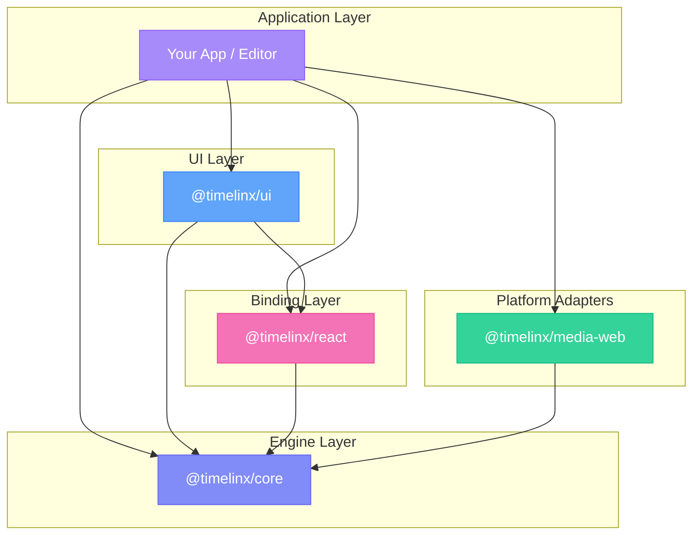
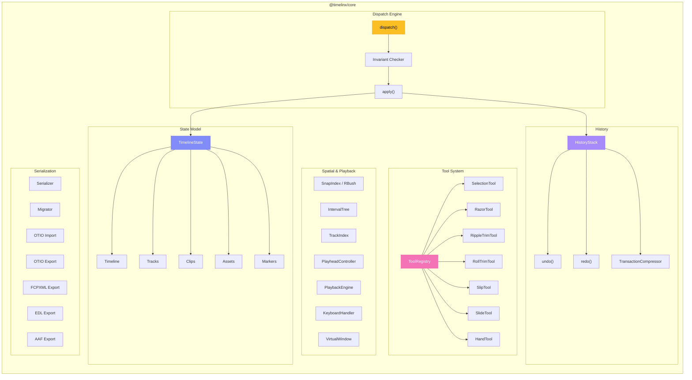
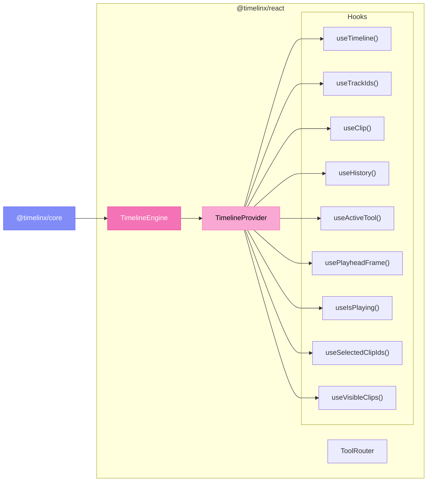
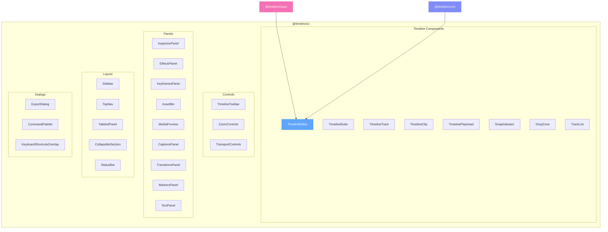
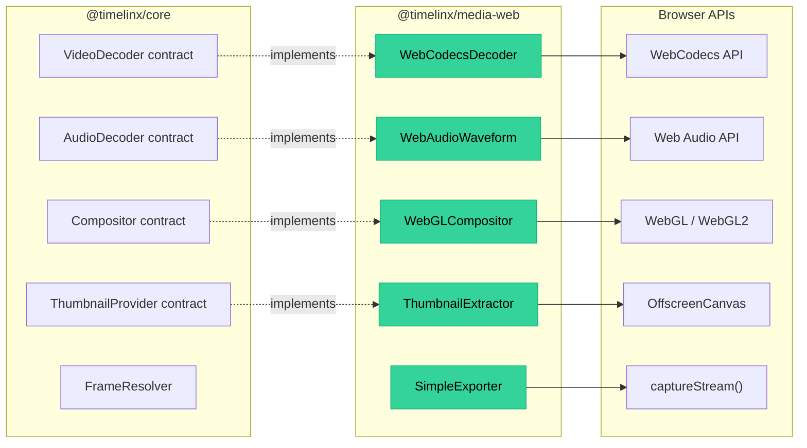
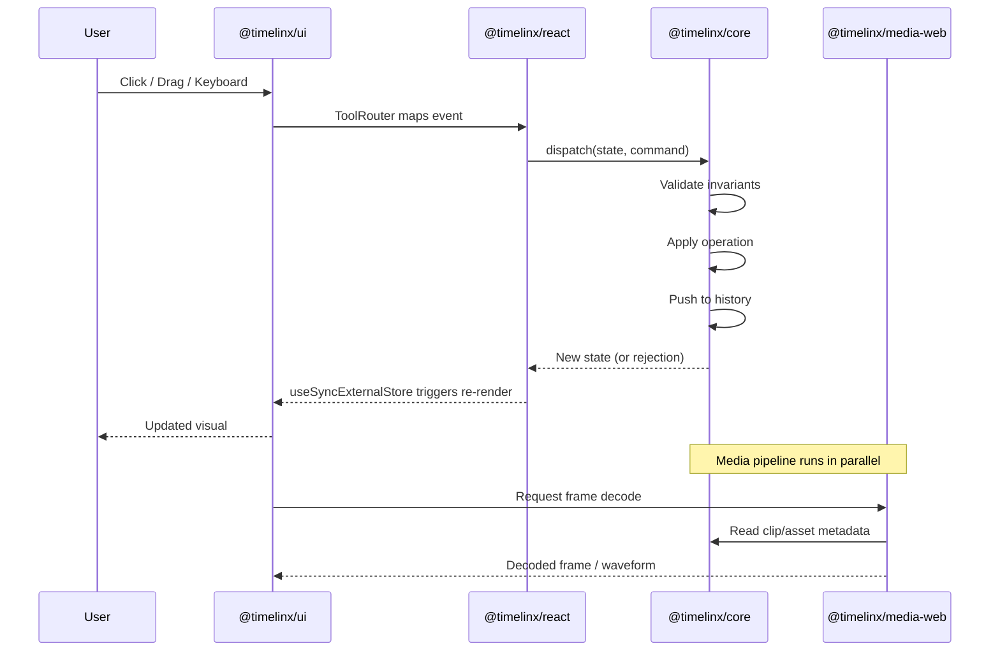
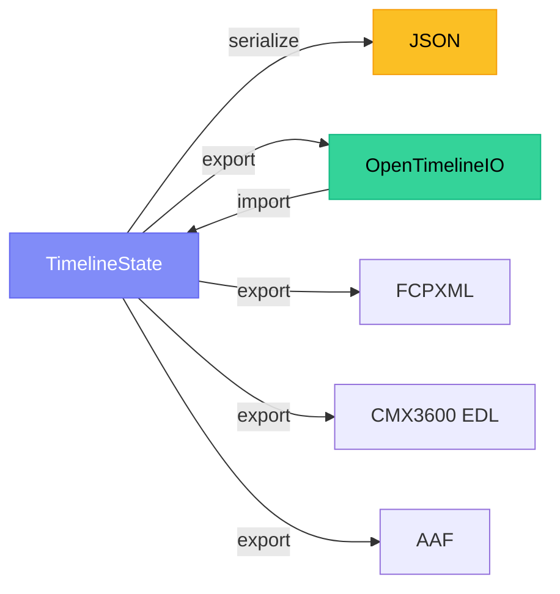

import { Cards, Card } from 'fumadocs-ui/components/card';
import { Callout } from 'fumadocs-ui/components/callout';
import { Box, Pencil, Layout, Video } from 'lucide-react';

Timelinx is a modular monorepo with four published packages. Each layer depends only on the layers below it  - you can use any layer independently.

## Package Dependency Graph

## The Layers

<Cards>
  <Card title="Core" href="/docs/core" icon={<Box style={{ color: '#c084fc' }} />}>
    The headless engine. Pure-function dispatch model for timeline state management. Zero runtime dependencies, no side effects.
  </Card>
  <Card title="React" href="/docs/react" icon={<Pencil style={{ color: '#aa99ff' }} />}>
    React bindings. Bridges the core engine to React's rendering model via `useSyncExternalStore`.
  </Card>
  <Card title="UI" href="/docs/ui" icon={<Layout style={{ color: '#60a5fa' }} />}>
    UI components. Drop-in React components for building timeline editors. Tracks, clips, panels, and more.
  </Card>
  <Card title="Media Web" href="/docs/media-web" icon={<Video style={{ color: '#34d399' }} />}>
    Web-native media adapters. WebCodecs decoding, WebAudio waveforms, thumbnail extraction, WebGL compositing, and export.
  </Card>
</Cards>

---

## Core Internal Architecture

`@timelinx/core` is the foundation  - a deterministic, frame-based editing kernel with zero runtime dependencies.

**Key design decisions:**
- **Pure functions**  - `dispatch(state, command)` returns a new state or a rejection. No mutations, no side effects.
- **Branded IDs**  - `ClipId`, `TrackId`, `AssetId` are branded string types that prevent accidental misuse.
- **Frame-based time**  - All positions are integer frames, eliminating floating-point drift.
- **24 invariant types**  - Every mutation is validated before it's applied.

---

## React Binding Architecture

`@timelinx/react` bridges the core engine to React's rendering model.

<Callout title="Key insight">
  Uses `useSyncExternalStore` so only components that read changed state re-render. No prop drilling, no unnecessary renders.
</Callout>

---

## UI Component Map

`@timelinx/ui` provides 29+ React components organized into five categories:

---

## Media Pipeline

`@timelinx/media-web` implements the pipeline contracts defined in `@timelinx/core` using browser-native APIs:

---

## End-to-End Data Flow

This is how a user interaction flows through the entire stack:

---

## Serialization & Interchange

`@timelinx/core` supports multiple interchange formats for professional workflows:

All state is plain objects  - no class instances, no circular references. Serialize to JSON, persist anywhere, sync across tabs, or send to a server.

---

<Cards>
  <Card title="Quick Start" href="/docs/library/quick-start">
    Build your first timeline in minutes.
  </Card>
  <Card title="Core Concepts" href="/docs/core">
    Deep dive into the dispatch model.
  </Card>
</Cards>
