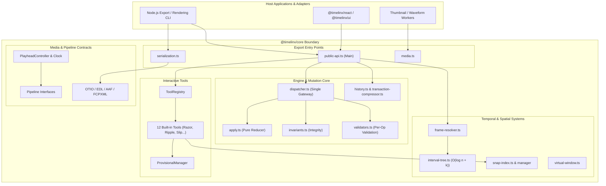
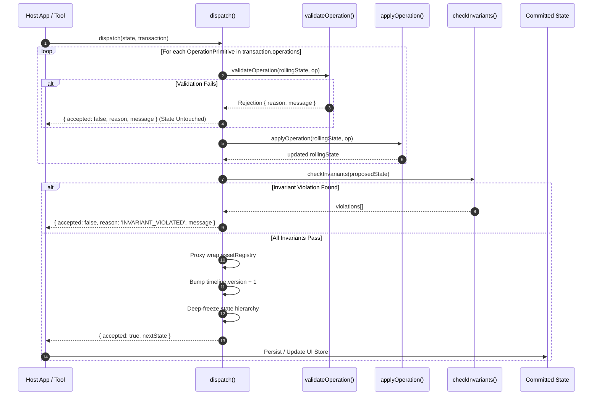
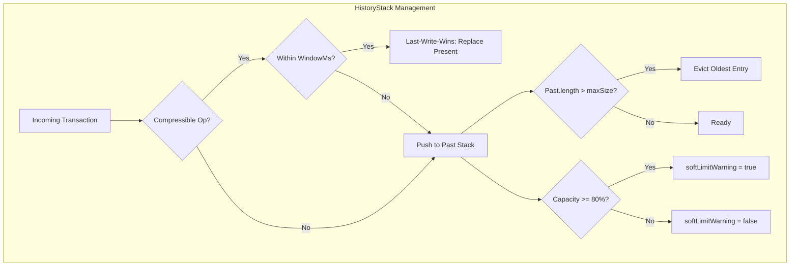

# High-Level Design (HLD) — `@timelinx/core`

> **Canonical Architecture Blueprint for the Timelinx Non-Linear Editing (NLE) Kernel**  
> Package: `@timelinx/core`  
> Schema Version: `2` (`CURRENT_SCHEMA_VERSION`)  
> Target Environments: Browser (Main Thread & Web Workers), Node.js, Edge / Serverless  
> Runtime Dependencies: `0` (Zero external dependencies; pure TypeScript/JavaScript)

---

## Table of Contents

1. [Executive Summary & Architectural Tenets](#1-executive-summary--architectural-tenets)
2. [System Topology & Package Boundaries](#2-system-topology--package-boundaries)
3. [Domain Model & State Architecture](#3-domain-model--state-architecture)
4. [The Single Mutation Engine: Transaction & Dispatch](#4-the-single-mutation-engine-transaction--dispatch)
5. [Invariants & Document Integrity Pipeline](#5-invariants--document-integrity-pipeline)
6. [Temporal Modeling & Spatial Indexing](#6-temporal-modeling--spatial-indexing)
7. [History, State Evolution & Compression](#7-history-state-evolution--compression)
8. [Interactive Tool Subsystem & Ghost States](#8-interactive-tool-subsystem--ghost-states)
9. [Snapping Engine](#9-snapping-engine)
10. [Media Contracts & Playback Subsystem](#10-media-contracts--playback-subsystem)
11. [Interchange & Serialization Architecture](#11-interchange--serialization-architecture)
12. [Integration Patterns & Consumer Contracts](#12-integration-patterns--consumer-contracts)
13. [Non-Functional Requirements & Performance Matrix](#13-non-functional-requirements--performance-matrix)

---

## 1. Executive Summary & Architectural Tenets

`@timelinx/core` is a deterministic, headless, framework-agnostic Non-Linear Editor (NLE) timeline kernel. It serves as the foundational computational core that coordinates video tracks, audio channels, transitions, effects, keyframes, captions, playhead motion, snapping geometry, and interchange formats.

The core package contains **zero DOM dependencies, zero React imports, and zero native decoding engines**. It delegates rendering, UI layout, audio mixing, and pixel manipulation to higher layers (`@timelinx/react`, `@timelinx/ui`, `@timelinx/media-web`, or custom server rendering pipelines).

```
 ┌────────────────────────────────────────────────────────────────────────┐
 │                     CONSUMERS & HOST APPLICATIONS                      │
 │    React UI (@timelinx/ui)   │   Web Workers   │   Node.js CLI/SSR     │
 └───────────────────────────────────┬────────────────────────────────────┘
                                     │ consumes via public API
                                     ▼
 ┌────────────────────────────────────────────────────────────────────────┐
 │                           @timelinx/core                               │
 │                                                                        │
 │   ┌───────────────────────┐              ┌─────────────────────────┐   │
 │   │     Domain Types      │              │    Mutation Pipeline    │   │
 │   │  • Branded Entities   │              │  • Transaction Batch    │   │
 │   │  • TimelineState (v2) │              │  • Rolling Validation   │   │
 │   │  • AssetRegistry      │              │  • Pure apply()         │   │
 │   └──────────┬────────────┘              │  • Invariants Checker   │   │
 │              │                           └────────────┬────────────┘   │
 │              ▼                                        ▼                │
 │   ┌───────────────────────┐              ┌─────────────────────────┐   │
 │   │   Indexing & Math     │              │    Interactive Tools    │   │
 │   │  • IntervalTree       │              │  • 12 Built-in Tools    │   │
 │   │  • SnapIndex (Sorted) │              │  • ToolRegistry         │   │
 │   │  • Frame Resolver     │              │  • Provisional States   │   │
 │   └──────────┬────────────┘              └────────────┬────────────┘   │
 │              │                                        │                │
 │              ▼                                        ▼                │
 │   ┌───────────────────────┐              ┌─────────────────────────┐   │
 │   │   History & Checkpts  │              │  Interchange & Media    │   │
 │   │  • Pure History API   │              │  • OTIO, EDL, AAF, FCP  │   │
 │   │  • HistoryStack       │              │  • SRT/VTT Subtitles    │   │
 │   │  • Op Compressor      │              │  • Playhead / Pipeline  │   │
 │   └───────────────────────┘              └─────────────────────────┘   │
 └────────────────────────────────────────────────────────────────────────┘
```

### Core Architectural Tenets

1. **Zero Runtime Dependencies**: The package relies exclusively on standard ECMAScript / TypeScript data structures (`Map`, `Set`, `Array`, `Proxy`, `Object.freeze`). It executes identically in modern web browsers, Web Workers, Node.js servers, and edge runtimes.
2. **Strict Unidirectional Data Flow**: State cannot be mutated directly. There are no public setters or in-place mutations. Any change to the project must be encapsulated into a `Transaction` and committed via the pure `dispatch(state, tx)` function.
3. **Immutability with Structural Sharing**: Mutations produce a new state tree. Unchanged branches retain object identity, enabling $O(1)$ reference equality checks for React's `useSyncExternalStore` or memoized rendering pipelines.
4. **Defensive All-or-Nothing Atomicity**: A transaction consists of one or more atomic operations. If any operation fails validation, or if the resulting timeline violates any document-level invariant, the transaction is rejected completely, returning the original state untouched with a deterministic error code.
5. **Nominal Branded Typing**: Entity IDs (`ClipId`, `TrackId`, `AssetId`, `TimelineFrame`, `Timecode`, `ToolId`) are branded strings and numbers. This prevents domain errors (e.g. passing a raw number as a frame count or confusing a track ID with a clip ID) at compile time without runtime wrapper overhead.
6. **Frame-Accurate Determinism**: Temporal positions are anchored to integer frame counts (`TimelineFrame`). Float-based time math is disallowed internally, eliminating floating-point rounding drift across playback and compound trims.
7. **Abstract Pipeline Contracts**: The core orchestrates edit logic and time synchronization, but never decodes pixels or samples audio directly. It exposes clean functional interfaces (`VideoDecoder`, `AudioDecoder`, `Compositor`, `ThumbnailProvider`) that host applications implement.

---

## 2. System Topology & Package Boundaries

`@timelinx/core` provides four distinct subpath export targets configured in `package.json`, maintaining strict separation of concerns:

```
@timelinx/core
├── .                    (Root: public-api.ts) -> Types, Dispatcher, Invariants, History, Tools
├── /serialization       (serialization.ts)    -> OTIO, CMX 3600 EDL, AAF, FCPXML, JSON
├── /media               (media.ts)            -> SRT/VTT parser, Marker search, Thumbnail queue, Worker types
└── /internal            (internal.ts)         -> Low-level shims, test doubles, internals
```

### System Component Diagram



---

## 3. Domain Model & State Architecture

### 3.1 Document Hierarchy

The top-level root document is `TimelineState`. It is self-contained and serializable:

```
TimelineState
├── schemaVersion: 2 (CURRENT_SCHEMA_VERSION)
├── timeline: Timeline
│   ├── id: string
│   ├── name: string
│   ├── fps: FrameRate (23.976 | 24 | 25 | 29.97 | 30 | 50 | 59.94 | 60)
│   ├── duration: TimelineFrame
│   ├── startTimecode: Timecode
│   ├── version: number (monotonically incremented on each accepted dispatch)
│   ├── sequenceSettings: SequenceSettings (color space, sample rate, aspect ratio)
│   ├── tracks: Track[]
│   │   ├── id: TrackId
│   │   ├── name: string
│   │   ├── type: 'video' | 'audio' | 'subtitle' | 'title'
│   │   ├── locked: boolean
│   │   ├── muted: boolean
│   │   ├── solo: boolean
│   │   ├── height: number (clamped 40-200)
│   │   ├── opacity?: number ([0, 1])
│   │   ├── blendMode?: string
│   │   ├── groupId?: TrackGroupId
│   │   ├── clips: Clip[] (ALWAYS sorted ascending by timelineStart)
│   │   └── captions: Caption[] (sorted ascending by startFrame)
│   ├── markers: Marker[] (point or range markers)
│   ├── beatGrid: BeatGrid | null (bpm, timeSignature, offset)
│   ├── inPoint: TimelineFrame | null
│   ├── outPoint: TimelineFrame | null
│   ├── trackGroups: TrackGroup[]
│   └── linkGroups: LinkGroup[] (links 2+ clips across tracks)
└── assetRegistry: AssetRegistry (ReadonlyMap<AssetId, Asset>)
    ├── FileAsset (kind: 'file', filePath, intrinsicDuration, nativeFps, status)
    └── GeneratorAsset (kind: 'generator', generatorDef, intrinsicDuration, status)
```

### 3.2 Branded Type System

To prevent type confusion, all domain identifiers and frame values use TypeScript compile-time branding:

```typescript
type Brand<K, T> = K & { readonly __brand: T };

export type ClipId        = Brand<string, 'ClipId'>;
export type TrackId       = Brand<string, 'TrackId'>;
export type AssetId       = Brand<string, 'AssetId'>;
export type EffectId      = Brand<string, 'EffectId'>;
export type KeyframeId    = Brand<string, 'KeyframeId'>;
export type MarkerId      = Brand<string, 'MarkerId'>;
export type TransitionId  = Brand<string, 'TransitionId'>;
export type CaptionId     = Brand<string, 'CaptionId'>;
export type LinkGroupId   = Brand<string, 'LinkGroupId'>;
export type TrackGroupId  = Brand<string, 'TrackGroupId'>;
export type ProjectId     = Brand<string, 'ProjectId'>;
export type BinId         = Brand<string, 'BinId'>;
export type GeneratorId   = Brand<string, 'GeneratorId'>;
export type ToolId        = Brand<string, 'ToolId'>;
export type TimelineFrame = Brand<number, 'TimelineFrame'>;
export type Timecode      = Brand<string, 'Timecode'>;
```

Constructors like `toClipId(str)`, `toTrackId(str)`, and `toFrame(num)` create branded values with zero runtime cost.

### 3.3 Clip Anatomy and Temporal Invariants

Every `Clip` defines two distinct coordinate windows:
1. **Timeline Placement**: `[timelineStart, timelineEnd)` in timeline frames.
2. **Source Media Viewport**: `[mediaIn, mediaOut)` in asset media frames.

```
Source Asset (intrinsicDuration = 500)
┌────────────────────────────────────────────────────────┐
│                                                        │
│             [=== mediaIn=100 ... mediaOut=220 ===)      │  mediaDuration = 120
└────────────────────────────────────────────────────────┘
                              │
                              ▼ mapped via clip.speed = 1.0
Timeline Track (duration = 1000)
─────────────┬─────────────────────────────────────┬─────
             │ [=== start=300 ... end=420 ===)     │         timelineDuration = 120
─────────────┴─────────────────────────────────────┴─────
```

**Mathematical Relationship**:
$$\text{mediaOut} - \text{mediaIn} = \frac{\text{timelineEnd} - \text{timelineStart}}{\text{speed}}$$

For normal playback (`speed = 1.0`):
- $\Delta \text{media} = \Delta \text{timeline}$
- $\text{mediaIn} \ge 0$
- $\text{mediaOut} \le \text{asset.intrinsicDuration}$
- $\text{timelineEnd} \le \text{timeline.duration}$
- $\text{speed} > 0$

### 3.4 The Asset Registry and Proxy Protection

Media files are registered in `assetRegistry` (`ReadonlyMap<AssetId, Asset>`). Clips reference assets strictly via `clip.assetId`. This design guarantees:
- Modifying or repathing an asset (e.g. switching from raw 4K footage to 720p editing proxy) occurs in $O(1)$ by updating the registry without touching any individual clips.
- Clips cannot be orphaned: unregistering an asset referenced by any existing clip is rejected by the invariant pipeline (`ASSET_IN_USE`).
- Runtime immutability: When committed, `assetRegistry` is wrapped in a JavaScript `Proxy` that intercepts and throws `TypeError` on `.set()`, `.delete()`, or `.clear()`, preventing illegal runtime mutations.

---

## 4. The Single Mutation Engine: Transaction & Dispatch

### 4.1 Unidirectional Pipeline

The dispatcher (`dispatch`) is the sole entry point for modifying `TimelineState`. Direct mutations (e.g., `state.timeline.duration = 100`) are prevented by compile-time `readonly` modifiers and runtime `Object.freeze`.



### 4.2 Rolling Validation Principle

When a `Transaction` contains multiple primitives (e.g., a compound edit like `[DELETE_CLIP, INSERT_CLIP(left), INSERT_CLIP(right)]`), subsequent primitives must be evaluated against the intermediate state produced by previous primitives.

If primitive #2 was validated against the initial state, an insert into the space occupied by the deleted clip would falsely trigger an `OVERLAP` rejection. By advancing a local `rollingState`, the dispatcher guarantees that compound operations are validated sequentially while remaining atomically rollback-safe if any subsequent op fails.

### 4.3 Structural Sharing & Frozen Immutability

To prevent reference degradation, `applyOperation` performs fine-grained structural sharing:
- When a clip on Track 2 is moved, Track 1 and Track 3 retain their exact object identity (`track === oldTrack`).
- When a track is modified, only that track object and its parent tracks array are reallocated.
- Deep-cloning is explicitly forbidden because React's `useSyncExternalStore` and selector hooks (`useTrack`, `useClip`) rely on reference equality (`Object.is`) to bypass re-rendering unchanged components.
- The returned `nextState`, `nextState.timeline`, `nextState.timeline.tracks`, and all modified sub-trees are recursively frozen with `Object.freeze()`.

### 4.4 Complete Operations Taxonomy (42+ Primitives)

Operations are discriminated unions adhering to `OperationPrimitive`:

| Category | Primitive Type | Key Payload Fields | Functional Intent |
| :--- | :--- | :--- | :--- |
| **Clip** | `INSERT_CLIP` | `clip: Clip, trackId: TrackId` | Adds a new clip to a track |
| | `DELETE_CLIP` | `clipId: ClipId` | Removes a clip from the timeline |
| | `MOVE_CLIP` | `clipId, newTimelineStart, targetTrackId?` | Moves clip on/between tracks |
| | `RESIZE_CLIP` | `clipId, edge: 'start'\|'end', newFrame` | Trims head or tail in timeline space |
| | `SLICE_CLIP` | `clipId, atFrame` | Splits a clip into two distinct clips |
| | `SET_MEDIA_BOUNDS` | `clipId, mediaIn, mediaOut` | Adjusts underlying source media window |
| | `SET_CLIP_SPEED` | `clipId, speed: number` | Changes playback speed multiplier |
| | `SET_CLIP_ENABLED` | `clipId, enabled: boolean` | Toggles clip active rendering state |
| | `SET_CLIP_REVERSED`| `clipId, reversed: boolean` | Reverses clip playback direction |
| | `SET_CLIP_NAME` | `clipId, name: string \| null` | Renames display label |
| | `SET_CLIP_COLOR` | `clipId, color: string \| null` | Sets UI highlight color |
| **Track** | `ADD_TRACK` | `track: Track` | Inserts video, audio, or subtitle track |
| | `DELETE_TRACK` | `trackId: TrackId` | Removes track (must be empty or force) |
| | `REORDER_TRACK` | `trackId, newIndex: number` | Adjusts track visual/z-order stacking |
| | `SET_TRACK_HEIGHT` | `trackId, height: number` | Modifies track UI height (clamped 40-200) |
| | `SET_TRACK_NAME` | `trackId, name: string` | Renames track label |
| | `SET_TRACK_OPACITY`| `trackId, opacity: number` | Sets composite track opacity ([0, 1]) |
| | `SET_TRACK_BLEND_MODE`| `trackId, blendMode: string` | Sets track compositing blend mode |
| **Asset** | `REGISTER_ASSET` | `asset: Asset` | Registers media file or generator |
| | `UNREGISTER_ASSET`| `assetId: AssetId` | Removes asset (rejected if clips use it) |
| | `SET_ASSET_STATUS`| `assetId, status: AssetStatus` | Sets online, offline, proxy-only |
| **Timeline** | `RENAME_TIMELINE` | `name: string` | Renames the timeline sequence |
| | `SET_TIMELINE_DURATION`| `duration: TimelineFrame` | Adjusts timeline sequence boundary |
| | `SET_TIMELINE_START_TC`| `startTimecode: Timecode` | Sets SMPTE starting timecode |
| | `SET_SEQUENCE_SETTINGS`| `settings: Partial<SequenceSettings>` | Sets sample rate, aspect ratio, color |
| **Markers** | `ADD_MARKER` | `marker: Marker` | Adds point or range marker |
| | `MOVE_MARKER` | `markerId, newFrame: TimelineFrame` | Moves marker anchor point |
| | `DELETE_MARKER` | `markerId: MarkerId` | Deletes marker |
| **In/Out** | `SET_IN_POINT` | `frame: TimelineFrame \| null` | Sets editorial mark-in boundary |
| | `SET_OUT_POINT` | `frame: TimelineFrame \| null` | Sets editorial mark-out boundary |
| **Beat Grid**| `ADD_BEAT_GRID` | `beatGrid: BeatGrid` | Attaches BPM and musical meter grid |
| | `REMOVE_BEAT_GRID`| _none_ | Clears beat grid |
| **Captions** | `ADD_CAPTION` | `caption: Caption, trackId` | Adds timed subtitle/caption segment |
| | `EDIT_CAPTION` | `captionId, trackId, text?, style?` | Modifies caption text or visual styling |
| | `DELETE_CAPTION` | `captionId, trackId` | Removes caption segment |
| **Effects** | `ADD_EFFECT` | `clipId, effect: Effect` | Attaches effect layer to clip |
| | `REMOVE_EFFECT` | `clipId, effectId: EffectId` | Detaches effect from clip |
| | `REORDER_EFFECT` | `clipId, effectId, newIndex` | Changes effect processing order |
| | `SET_EFFECT_ENABLED`| `clipId, effectId, enabled` | Toggles effect active bypass |
| | `SET_EFFECT_PARAM` | `clipId, effectId, key, value` | Modifies effect parameter value |
| **Keyframes**| `ADD_KEYFRAME` | `clipId, effectId, keyframe` | Adds parameter keyframe point |
| | `MOVE_KEYFRAME` | `clipId, effectId, keyframeId, frame`| Shifts keyframe timing |
| | `DELETE_KEYFRAME` | `clipId, effectId, keyframeId` | Removes parameter keyframe |
| | `SET_KEYFRAME_EASING`| `clipId, effectId, keyframeId, easing`| Sets Linear, Hold, Bezier, EaseIn/Out |
| **Transitions**| `ADD_TRANSITION` | `clipId, transition: Transition` | Attaches cut transition (dissolve/wipe) |
| | `DELETE_TRANSITION`| `clipId` | Removes transition |
| | `SET_TRANSITION_DURATION`| `clipId, durationFrames` | Modifies transition frame length |
| | `SET_TRANSITION_ALIGNMENT`| `clipId, alignment` | centerOnCut, startAtCut, endAtCut |
| **Grouping**| `LINK_CLIPS` | `linkGroup: LinkGroup` | Links multiple clips (A/V sync lock) |
| | `UNLINK_CLIPS` | `linkGroupId: LinkGroupId` | Dissolves clip link group |
| | `ADD_TRACK_GROUP` | `trackGroup: TrackGroup` | Organizes tracks into collapsible folders |
| | `DELETE_TRACK_GROUP`| `trackGroupId: TrackGroupId` | Removes track folder hierarchy |

---

## 5. Invariants & Document Integrity Pipeline

The `checkInvariants(state)` pipeline runs at Step 3 of every dispatch and is executed across all unit tests. It acts as an unbreakable firewall preventing state corruption.

```mermaid
flowchart LR
    S1[1. Schema Version] --> S2[2. Duplicate IDs]
    S2 --> S3[3. Track Sorting]
    S3 --> S4[4. Overlap Detection]
    S4 --> S5[5. Track Type Parity]
    S5 --> S6[6. Finite Frame Bounds]
    S6 --> S7[7. Asset Existence]
    S7 --> S8[8. Media Bounds]
    S8 --> S9[9. Duration & Speed]
    S9 --> S10[10. Markers & In/Out]
    S10 --> S11[11. Captions & Groups]
```



### The 17 Invariant Checks in Execution Order

1. **Schema Version Check**: `state.schemaVersion === CURRENT_SCHEMA_VERSION`. Early exits on failure to prevent evaluating incompatible future or legacy schemas.
2. **Global Duplicate ID Detection**: Verifies that no two tracks, clips, markers, or assets share the same identifier anywhere in the project.
3. **Track Sort Integrity**: For every track, `clips` must be sorted ascending by `timelineStart`. `clips[i-1].timelineStart <= clips[i].timelineStart`.
4. **Zero Overlap Guarantee**: On any given track, no two clips may overlap in time:
   $$\text{track.clips}[i].\text{timelineEnd} \le \text{track.clips}[i+1].\text{timelineStart}$$
   Because clips are strictly sorted, this is verified in $O(n)$ by evaluating adjacent pairs.
5. **Track Type Parity**: A clip's asset `mediaType` must match the parent track's `type` (`video` on video tracks, `audio` on audio tracks, etc.).
6. **Finite Integer Frame Values**: `timelineStart`, `timelineEnd`, `mediaIn`, and `mediaOut` must be finite non-negative integers. Zero-duration clips (`timelineStart === timelineEnd`) are strictly forbidden.
7. **Asset Referential Integrity**: Every `clip.assetId` must exist in `state.assetRegistry`.
8. **Media In Bounds**: `clip.mediaIn >= 0`.
9. **Media Out Bounds**: `clip.mediaOut <= asset.intrinsicDuration`.
10. **Duration vs Speed Parity**: The media duration must match the timeline duration scaled by speed:
    $$|\,(\text{mediaOut} - \text{mediaIn}) - (\text{timelineEnd} - \text{timelineStart}) / \text{speed}\,| \le 0.5$$
11. **Timeline Boundary Enforcement**: No clip may extend beyond the sequence duration: `clip.timelineEnd <= timeline.duration`.
12. **Speed Validity**: `clip.speed > 0` and finite.
13. **Marker Frame Bounds**: Point markers must satisfy $0 \le \text{frame} < \text{duration}$. Range markers must satisfy $0 \le \text{frameStart} < \text{frameEnd} \le \text{duration}$.
14. **In/Out Point Consistency**: If defined, $0 \le \text{inPoint} < \text{outPoint} \le \text{duration}$.
15. **Caption Track Constraints**: Captions must not overlap and must satisfy $0 \le \text{startFrame} < \text{endFrame} \le \text{duration}$.
16. **Keyframe Ordering & Render Stages**: Effect keyframes must be sorted ascending by frame without duplicates. Effect render stages must be `'preComposite'`, `'postComposite'`, or `'output'`.
17. **Link & Track Group Integrity**: Link groups must contain $\ge 2$ valid clips. No clip may belong to multiple link groups. Track groups must reference extant tracks. Track opacity must be within $[0, 1]$.

---

## 6. Temporal Modeling & Spatial Indexing

### 6.1 Time Representation

Time is expressed across three distinct representations depending on the system layer:

| Type | Structure | Primary Use | Properties |
| :--- | :--- | :--- | :--- |
| `TimelineFrame` | `number & { __brand: 'TimelineFrame' }` | Internal Engine & Invariants | Integer, 0-indexed, absolute frame count |
| `Timecode` | `string & { __brand: 'Timecode' }` | UI Display & EDLs | SMPTE standard format (`HH:MM:SS:FF` or `HH:MM:SS;FF`) |
| `RationalTime` | `{ value: number; rate: FrameRate }` | OTIO & Ingest/Export | Precise fraction representing non-integer frame bases |

Supported frame rates (`FrameRate`): `23.976`, `24`, `25`, `29.97`, `30`, `50`, `59.94`, `60`. Drop-frame timecode math (`isDropFrame`) adheres strictly to SMPTE standards, dropping timecode numbers 00 and 01 at the start of every minute except minutes 00, 10, 20, 30, 40, 50 at 29.97 fps.

### 6.2 Centered Interval Tree (`IntervalTree`)

Linear scans across thousands of clips during playback or rendering degrade performance from $O(1)$ to $O(n)$. `@timelinx/core` implements a Centered Interval Tree (`engine/interval-tree.ts`) for fast temporal queries:

- **Storage**: Stores intervals $[start, end)$ representing clip bounds.
- **Node Balance**: Nodes are split using the median of interval midpoints:
  $$\text{center} = \text{median}\left(\left\{\frac{\text{start}_i + \text{end}_i}{2}\right\}\right)$$
- **Query Complexity**: Given any playhead frame $t$, queries return all visible clips in:
  $$O(\log n + k)$$
  where $n$ is the total clip count and $k$ is the number of intersecting clips (typically equal to the active track count).

```
              Node (center = 500)
             /                   \
    Left (end <= 500)       Right (start > 500)
    Intervals: [0, 300)     Intervals: [600, 900)
               [200, 450)              [700, 1000)
                     Crossing (straddles 500)
                     Intervals: [400, 650)
                                [350, 550)
```

### 6.3 Frame Resolver (`resolveFrame`)

At each playhead position, the frame resolver computes which clips are visible, their media-in playback offsets, and their compositing transformations:

$$\text{mediaFrame} = \text{clip.mediaIn} + (t - \text{clip.timelineStart})$$

It produces a `ResolvedCompositeRequest` containing ordered visual layers (`ResolvedLayer[]`) sorted by track index (z-order), including opacity, blend modes, clip transforms, and active effects.

### 6.4 Virtual Windowing (`virtual-window.ts`)

For massive timelines (e.g. 10,000 clips), rendering DOM nodes or canvas elements offscreen exhausts memory. `getVisibleFrameRange(scrollLeft, viewportWidth, zoom)` and `getVisibleClips(track, window)` use binary search to return only the subset of clips within the visible viewport buffer in $O(\log n + m)$ time.

---

## 7. History, State Evolution & Compression

The history subsystem provides two complementary APIs: a pure functional interface for testing and headless use, and an enterprise state container (`HistoryStack`) for production applications.



### 7.1 Pure History API

```typescript
type HistoryState = {
  readonly past: readonly TimelineState[];
  readonly present: TimelineState;
  readonly future: readonly TimelineState[];
  readonly limit: number;
};

createHistory(initialState, limit?): HistoryState
pushHistory(history, newState): HistoryState
undo(history): HistoryState
redo(history): HistoryState
```

Every undo/redo operation rotates references without allocating or mutating history records.

### 7.2 Transaction Compression (`TransactionCompressor`)

High-frequency interactive gestures (such as dragging a clip, scrubbing a slider, or adjusting transform opacity) can dispatch 60 operations per second. Storing every intermediate step fills the undo buffer with micro-steps, making undo unusable.

The `TransactionCompressor` implements a **Last-Write-Wins (LWW)** policy over a configurable sliding time window (default `300ms`). When consecutive operations of the same compressible type target the same entity within the window, the previous present state is updated in place rather than pushing a new history entry:

**Compressible Operations**:
- `MOVE_CLIP`, `SET_CLIP_TRANSFORM`, `SET_AUDIO_PROPERTIES`, `SET_EFFECT_PARAM`
- `MOVE_KEYFRAME`, `SET_TRANSITION_DURATION`, `MOVE_MARKER`, `SET_IN_POINT`, `SET_OUT_POINT`, `SET_TRACK_OPACITY`

### 7.3 Checkpoints and Stack Serialization

`HistoryStack` supports enterprise production requirements:
- **Named Checkpoints**: `saveCheckpoint(name)`, `restoreCheckpoint(name)`, and `clearCheckpoint(name)` allow branching, auto-save states, and quick reverts without losing the linear undo stack.
- **Serialization**: `serialize()` and `HistoryStack.deserialize(json)` preserve the full past, present, future, and checkpoints across page reloads or local persistence.

---

## 8. Interactive Tool Subsystem & Ghost States

### 8.1 The `ITool` Lifecycle Contract

Tools encapsulate editing behavior. They bridge pointer/keyboard gestures to transactions. Tools are pure state handlers: they do not interact directly with the DOM or React.

```typescript
interface ITool {
  readonly id: ToolId;
  readonly shortcutKey: string;

  getCursor(ctx: ToolContext): string;
  getSnapCandidateTypes(): readonly SnapPointType[];

  onPointerDown(event: TimelinePointerEvent, ctx: ToolContext): void;
  onPointerMove(event: TimelinePointerEvent, ctx: ToolContext): ProvisionalState | null;
  onPointerUp(event: TimelinePointerEvent, ctx: ToolContext): Transaction | null;
  onKeyDown(event: TimelineKeyEvent, ctx: ToolContext): Transaction | null;
  onKeyUp(event: TimelineKeyEvent, ctx: ToolContext): void;
  onCancel(): void;
}
```

#### Strict Contract Rules:
1. `onPointerMove` **NEVER** calls `dispatch()`. It mutates zero engine state. It returns a `ProvisionalState` (ghost state) for rendering preview feedback.
2. `onPointerUp` constructs and returns a single atomic `Transaction` or `null`. It never mutates internal state.
3. `onCancel` must cleanly abort any pending drag state without side effects (e.g. if the user presses `Escape`).

### 8.2 Provisional (Ghost) State Architecture

While dragging a clip or trimming an edge, 60fps rendering of ghost boxes is required. Directly dispatching transactions during drag would cause:
1. Continuous execution of the full invariant pipeline on every mouse move.
2. Excessive garbage collection from state allocations.
3. History stack pollution with intermediate drag coordinates.

`ProvisionalState` solves this by decoupling drag previews from committed state:

```typescript
type ProvisionalState = {
  readonly clips: readonly Clip[];
  readonly captions?: readonly Caption[];
  readonly rubberBand?: RubberBandRegion;
  readonly isProvisional: true; // Compile-time discriminant
};
```

The UI layer combines committed state with `ProvisionalState` via `resolveClip(state, clipId, provisional)`. When the drag completes, `onPointerUp` outputs a single transaction, committing the final edit atomically.

```
Pointer Move (60Hz) ──────► onPointerMove() ──────► ProvisionalState (Live Ghost Render)
                                                           │
Pointer Up (Release) ────► onPointerUp()   ──────► Transaction ──► dispatch() ──► nextState
```

### 8.3 The 12 Built-in Editing Tools

```
               EDITING TOOLS
┌────────────────────────────────────────────────────────┐
│  Selection (V)  │  Razor (C)   │  Ripple Trim (T)      │
│  Roll Trim (R)  │  Slip (S)    │  Slide (Y)            │
│  Ripple Delete  │  Ripple Ins  │  Transition Tool      │
│  Keyframe Tool  │  Hand (H)    │  Zoom Tool            │
└────────────────────────────────────────────────────────┘
```

1. **SelectionTool (`select` / `V`)**: Supports single-clip click, marquee/rubber-band rectangular selection, modifier-based multi-selection (Shift/Cmd), and multi-clip parallel dragging across tracks.
2. **RazorTool (`razor` / `C`)**: Slices clips at the cursor frame. Splits underlying media bounds proportionally:
   $$\text{splitMedia} = \text{mediaIn} + (\text{sliceFrame} - \text{timelineStart})$$
   Yields two contiguous clips with identical speed and attributes.
3. **RippleTrimTool (`rippleTrim` / `T`)**: Trims the in-point or out-point of a clip while rippling (shifting) all subsequent downstream clips on the track to prevent gaps.
4. **RollTrimTool (`rollTrim` / `R`)**: Trims adjacent cut points simultaneously: as Clip A extends, Clip B shrinks by the exact same frame count, keeping total timeline duration unchanged.
5. **SlipTool (`slip` / `S`)**: Modifies `mediaIn` and `mediaOut` without changing `timelineStart`, `timelineEnd`, or clip duration. Slips source media under a static timeline window.
6. **SlideTool (`slide` / `Y`)**: Moves a clip along the timeline while dynamically trimming adjacent neighboring clips to accommodate the move without changing sequence duration.
7. **RippleDeleteTool (`rippleDelete`)**: Deletes selected clips and automatically closes gaps by shifting subsequent clips leftward.
8. **RippleInsertTool (`rippleInsert`)**: Splits existing clips at the insert point and shifts downstream content forward to accommodate new footage.
9. **TransitionTool (`transition`)**: Adds or adjusts audio/video transitions (cross-dissolves, wipes) centered on, starting at, or ending at clip cuts.
10. **KeyframeTool (`keyframe`)**: Direct manipulation of automation envelopes and parameter keyframe diamonds.
11. **HandTool (`hand` / `H`)**: Pans the timeline canvas horizontally and vertically without triggering clip selection or moves.
12. **ZoomTool (`zoom`)**: Zooms in/out centered on the click point or drags a rectangular zoom box.

---

## 9. Snapping Engine

### 9.1 Priority-Ranked Snapping

The snapping engine (`snap-index.ts`) extracts alignment points across the entire project into a flat, sorted array of `SnapPoint` records:

```typescript
type SnapPoint = {
  readonly frame: TimelineFrame;
  readonly type: SnapPointType;
  readonly priority: number;
  readonly trackId: TrackId | null;
  readonly sourceId: string;
};
```

#### Strict Priority Table:
| Snap Type | Priority Weight | Alignment Source |
| :--- | :---: | :--- |
| **Marker** | **100** | Point markers and range marker boundaries |
| **InPoint** | **90** | Timeline editorial mark-in frame |
| **OutPoint** | **90** | Timeline editorial mark-out frame |
| **ClipStart** | **80** | In-point head of any clip across any track |
| **ClipEnd** | **80** | Out-point tail of any clip across any track |
| **Playhead** | **70** | Current active playback playhead position |
| **BeatGrid** | **50** | Musical tempo beat and bar markers |

### 9.2 Binary Search Nearest Resolution

When dragging an entity, `nearest(snapIndex, targetFrame, toleranceFrames, excludeSourceIds, allowedTypes)` finds the closest snap target:
1. Performs a binary search ($O(\log N)$) to locate the nearest points within the frame tolerance window $[t - \delta, t + \delta]$.
2. Filters out candidate points matching `excludeSourceIds` (e.g. ignoring a clip's own original bounds during drag).
3. Evaluates priority: If a Marker (priority 100) and a Clip Boundary (priority 80) fall within the same distance, the Marker wins.
4. Returns the exact branded `TimelineFrame` to snap to.

### 9.3 Asynchronous Index Maintenance (`SnapIndexManager`)

Rebuilding the snap index across thousands of clips on every keystroke or frame render would waste CPU cycles. `SnapIndexManager` schedules index rebuilds via `queueMicrotask`:
- Rebuilds occur after accepted transactions commit.
- Never runs during active pointer moves (uses cached snapshot during gestures).

---

## 10. Media Contracts & Playback Subsystem

`@timelinx/core` models video playback as a state machine driven by a high-resolution clock, completely decoupled from decoding hardware.

```
 ┌────────────────────────────────────────────────────────────────────────┐
 │                         PlaybackEngine & Clock                         │
 └──────────────────┬─────────────────────────────────┬───────────────────┘
                    │ drives ticks                    │ syncs position
                    ▼                                 ▼
 ┌──────────────────────────────────────┐  ┌──────────────────────────────┐
 │          PlayheadController          │  │     resolveFrame() (Core)    │
 │  • Current Frame & Play/Pause        │  │  • Visible Clips             │
 │  • Playback Rate (-2x..+2x)          │  │  • Media Frame Offsets       │
 │  • J/K/L Shuttle & Looping           │  │  • Layer Transforms & Opacity│
 └──────────────────┬───────────────────┘  └──────────────┬───────────────┘
                    │ emits events                        │ produces request
                    ▼                                     ▼
 ┌────────────────────────────────────────────────────────────────────────┐
 │                       HOST PIPELINE IMPLEMENTATION                     │
 │   VideoDecoder (WebCodecs)   │  Compositor (WebGL/WebGPU/Canvas2D)     │
 │   AudioDecoder (WebAudio)    │  ThumbnailProvider                      │
 └────────────────────────────────────────────────────────────────────────┘
```

### 10.1 Pipeline Contracts (`pipeline.ts`)

The host application supplies implementations of four core asynchronous functions:

```typescript
type VideoDecoder       = (req: VideoFrameRequest) => Promise<VideoFrameResult>;
type AudioDecoder       = (req: AudioChunkRequest) => Promise<AudioChunkResult>;
type Compositor         = (req: CompositeRequest) => Promise<CompositeResult>;
type ThumbnailProvider  = (req: ThumbnailRequest) => Promise<ThumbnailResult>;
```

### 10.2 PlayheadController & Jog-Shuttle State

`PlayheadController` manages playhead frame position, frame-dropping telemetry, and transport controls:
- **J/K/L Shuttle Support**:
  - `L`: Shuttle forward ($1\times \to 2\times \to 4\times \to 8\times$).
  - `J`: Shuttle backward ($-1\times \to -2\times \to -4\times \to -8\times$).
  - `K`: Stop playback immediately.
- **Loop Regions & Preroll/Postroll**: Automates playback bounding for trimmed cut reviews.
- **Clock Implementations**:
  - `browserClock`: Uses `performance.now()` and `requestAnimationFrame`.
  - `nodeClock`: Uses `process.hrtime.bigint()` for headless test/render environments.
  - `createTestClock`: Fully deterministic manual tick advancement for unit testing.

### 10.3 Thumbnail Cache & Priority Queue

- `ThumbnailCache`: LRU cache with memory size clamping for decoded preview thumbnails.
- `ThumbnailQueue`: Prioritizes thumbnail generation requests: visible viewport clips receive `high` priority; offscreen scroll targets receive `low` priority.

---

## 11. Interchange & Serialization Architecture

`@timelinx/core` provides comprehensive import and export capabilities for industry interchange standards:

```
                            ┌───────────────────┐
                            │   TimelineState   │
                            └─────────┬─────────┘
                                      │
          ┌──────────────┬────────────┼────────────┬──────────────┐
          ▼              ▼            ▼            ▼              ▼
     Native JSON        OTIO         EDL          AAF           FCPXML
     Serializer      OpenTimeline  CMX 3600    Avid Media      Apple FCP
     (v2 Schema)     Format v1.0   Broadcast   Composer        XML v1.10
```

### 11.1 Native JSON & Schema Migrations (`migrator.ts`)

- `serializeTimeline(state: TimelineState): string`: Fast, deterministic JSON serializer.
- `deserializeTimeline(json: string): TimelineState`: Validates schema version against `CURRENT_SCHEMA_VERSION` (2).
- **Migration Pipeline**: Projects saved under older schema versions (e.g. v1) pass through sequential migrator functions:
  $$\text{v1} \xrightarrow{\text{migrateV1ToV2}} \text{v2} \xrightarrow{\text{validate}} \text{TimelineState}$$
  Future schema downgrades are detected and rejected to prevent silent data corruption.

### 11.2 OpenTimelineIO (OTIO) Interchange

Full bidirectional support for Pixar's OpenTimelineIO standard:
- `exportToOTIO(state)`: Serializes tracks, clips, gap items, markers, and media references to standard OTIO JSON schema.
- `importFromOTIO(doc)`: Ingests external OTIO sequences, mapping OTIO rational time bases and tracks into `TimelineState`.

### 11.3 Broadcast & NLE Formats

- **CMX 3600 EDL (`exportToEDL`)**: Standard broadcast edit decision lists with source reel mapping and drop-frame timecodes.
- **AAF Export (`exportToAAF`)**: Generates XML-based Advanced Authoring Format representations for ingest into Avid Media Composer and Pro Tools.
- **FCPXML 1.10 (`exportToFCPXML`)**: Exports modern Final Cut Pro XML sequence definitions including asset formats, spine tracks, and audio channel assignments.
- **Subtitle Parsers (`media.ts`)**: Pure regex-based parsers for SubRip (`.srt`) and WebVTT (`.vtt`) subtitles, converting cue markers into `ADD_CAPTION` primitives.

### 11.4 Asset Relinking & Offline Detection

- `remapAssetPaths(state, callback)`: Batch updates file paths when assets are moved to new storage volumes.
- `findOfflineAssets(state)`: Scans the project and returns a list of assets whose status is `'offline'` or `'missing'`.

---

## 12. Integration Patterns & Consumer Contracts

### 12.1 React Binding Pattern (`@timelinx/react`)

`@timelinx/core` is framework-agnostic. The official `@timelinx/react` binding integrates the core engine with React 18/19 via `useSyncExternalStore`:

```typescript
// TimelineEngine OO Wrapper provides external store contract:
class TimelineEngine {
  subscribe(listener: () => void): () => void;
  getSnapshot(): EngineSnapshot;
  dispatch(tx: Transaction): DispatchResult;
}

// React hook selector pattern:
export function useTrack(trackId: TrackId): Track | undefined {
  const engine = useEngine();
  return useSyncExternalStore(
    engine.subscribe,
    () => engine.getState().timeline.tracks.find(t => t.id === trackId)
  );
}
```

Because `@timelinx/core` uses structural sharing, selector hooks only trigger component re-renders when their specific slice of state changes reference identity.

### 12.2 Web Worker Offloading Pattern

Heavy operations like audio waveform peak computation and video thumbnail generation run off the main thread. `@timelinx/core` defines type contracts in `types/worker-contracts.ts`:

- `WaveformRequest`: `{ assetId, channel, startFrame, endFrame, buckets, sampleRate }`
- `WaveformWorkerResponse`: `{ requestId, peaks: WaveformPeak[] }`

Workers run the pure math algorithms; the main thread receives the computed peak buckets and caches them without UI stutter.

---

## 13. Non-Functional Requirements & Performance Matrix

### 13.1 Algorithmic Complexity Guarantees

| Operation / Query | Algorithm / Implementation | Computational Complexity | Notes |
| :--- | :--- | :---: | :--- |
| **Clip Lookup by ID** | `findClipById(state, id)` | $O(N_{\text{tracks}} \cdot N_{\text{clips}})$ | Fast path uses cached `TrackIndex` |
| **Visible Clips at Frame** | Centered `IntervalTree` | $O(\log N + K)$ | $K$ = active visible layers |
| **Nearest Snap Search** | Binary search over `SnapIndex` | $O(\log M)$ | $M$ = total project snap points |
| **Track Overlap Check** | Adjacent pair sweep on sorted array | $O(C)$ | $C$ = clips on track (already sorted) |
| **Full Invariant Check** | `checkInvariants(state)` | $O(N_{\text{total clips}})$ | Single linear validation pass |
| **Transaction Dispatch** | Rolling validation + apply + invariants | $O(P \cdot C + N_{\text{clips}})$ | $P$ = primitives in batch |
| **Viewport Culling** | `getVisibleClips` binary search | $O(\log C + V)$ | $V$ = visible clips in viewport |
| **Undo / Redo** | Reference rotation on `HistoryStack` | $O(1)$ | Zero state re-allocation |

### 13.2 Memory Management & Garbage Collection

- **Object Retention**: Rejected transactions create zero lingering references. Rolling proposed states are dropped and garbage collected.
- **Reference Sharing**: Committing a transaction on a 100-track timeline only reallocates the modified track. The remaining 99 tracks maintain memory identity.
- **Frozen Top-Level Objects**: `Object.freeze` overhead is negligible because only modified container arrays and records are frozen at commit time.

### 13.3 Zero-Dependency Boundary Verification

The package root `package.json` specifies empty runtime dependencies:

```json
{
  "name": "@timelinx/core",
  "version": "1.0.0-beta.3",
  "dependencies": {}
}
```

No polyfills, utility libraries (Lodash/Ramda), or UI components may ever be added to `@timelinx/core`.
