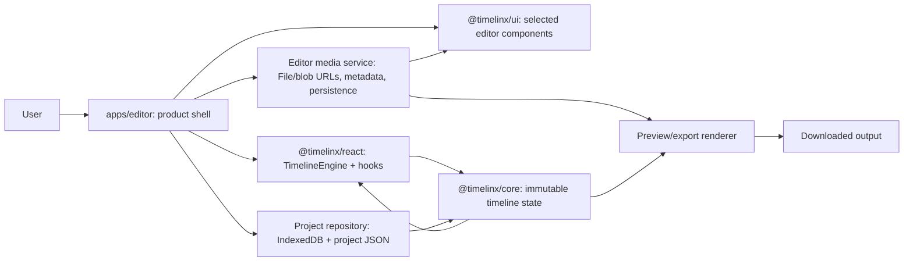

# Timelinx v1: Production Release Plan

> **Purpose.** This is the operating plan for turning the current Timelinx repository into a dependable first public editor release. It is intentionally opinionated: a solo developer should use it to decide what to build next, what to defer, and when a release is safe. It is also written to be the durable context supplied to an implementation model at the start of each task.
>
> **Last assessed:** 2026-08-23, against commit `69f7ad1` (`feat/editor-release-gate`). Re-assess the “current-state facts” after significant architecture changes.

## 1. Executive decision

Timelinx has a strong **headless editing engine** and credible React bindings. It does **not** yet have a production-ready editor application. The main gap is not more editing operations; it is one coherent, tested application that owns media, project persistence, preview, export, error recovery, and deployment.

The first stable release should therefore be a deliberately narrow browser editor:

- import supported local video, audio, and image files;
- arrange video/image clips and audio clips on a timeline;
- select, move, trim, split, delete, undo, redo, seek, and play/pause;
- preview the exact supported composition;
- add basic text titles;
- save a project locally and reopen it with clear relink behavior;
- export a supported project successfully with an honest browser/format contract.

Everything else is either disabled, hidden, or marked experimental until it has an end-to-end test. A stable small editor is a better release than a large UI where some buttons only modify timeline data but do not affect preview or export.

### The release target

**Product:** a client-side web editor deployed as a static/Vite app. No account, collaboration, cloud storage, server rendering, or backend is required for v1.

**Primary support target:** latest desktop Chrome and Edge on macOS/Windows. Firefox is “best effort” until its export behavior is automated and manually certified. Safari is unsupported for v1 unless the exact Safari version and output path are manually certified; do not promise MP4 merely because `MediaRecorder.isTypeSupported` returns true.

**Supported source media for v1:** short, local MP4/H.264 + AAC video, WebM video, MP3/WAV audio, and PNG/JPEG/WebP images. Enforce an explicit maximum file size and project duration after profiling the selected baseline machine. Show a helpful rejection message for anything else. Codec/container acceptance must be capability-tested, not inferred from file extension.

**Export contract for v1:** one clearly labelled browser-supported format—normally WebM on Chrome/Edge—at one fixed resolution/fps policy. If export does not include verified audio and video for the chosen browser, it is not a release feature. “MP4 if supported” is not a product promise.

## 2. Current-state assessment

### What is solid

| Layer              | Evidence in this repository                                                                                                                  | Release assessment                                                                                    |
| ------------------ | -------------------------------------------------------------------------------------------------------------------------------------------- | ----------------------------------------------------------------------------------------------------- |
| `@timelinx/core`   | Immutable state, validated transactions, history, snapping, tools, serialization/migrations, playback contracts, fuzz/hostile-consumer tests | Strong foundation; preserve its invariants and avoid changing it for application-only concerns.       |
| `@timelinx/react`  | `TimelineEngine`, subscriptions, providers, hooks, tool routing, latest critical-issue regression tests                                      | Good adapter foundation; it needs real-app integration coverage.                                      |
| `@timelinx/ui`     | Asset bin, canvas compositor, timeline components, media side-channel, export hook, panels and styles                                        | Useful component library, but it has two overlapping UI generations and limited integration coverage. |
| Documentation site | Builds successfully through the root workspace build                                                                                         | Suitable for library documentation, not a substitute for an editor demo or acceptance suite.          |
| Release automation | Changesets release workflow and npm publishing for public packages                                                                           | Reasonable package-release foundation; editor deployment/release is separate.                         |

### What blocks a stable editor release today

1. `apps/editor` mounts `TimelineLayout` plus a custom right panel only. It does **not** mount `MediaAssetsProvider`, `AssetBin`, `CompositorPreview`, `TopNav`, or `useExport`. Thus the checked-in app has no complete import → edit → preview → export user path.
2. `apps/editor/src/createEditorEngine.ts` injects a `stubPipeline` that returns `bitmap: null`. It is a demo timeline engine, not a real media pipeline.
3. ~~The app is deliberately excluded from the pnpm workspace. Root CI, root typecheck, root test, and root build do not test it.~~ **Resolved in P0.** The editor remains excluded from the workspace but now has its own lockfile, root `editor:*` scripts, a dedicated CI job, and a Playwright smoke test. `pnpm run editor:verify` and `pnpm run editor:e2e` are required gates.
4. The UI export path uses real-time `canvas.captureStream()` and `MediaRecorder`. It is browser-dependent, long-running, and not proven by browser E2E tests with real media. There is also a separate `SimpleExportAdapter`; one canonical export path must be chosen.
5. The compositor is Canvas2D with a fixed logical `1920 × 1080` canvas. It implements only a subset of effect types; `colorCorrect` and other effects intentionally have no Canvas filter mapping. Any effect that does not render identically in preview and export must be absent from v1.
6. There is no persisted editor-project/media strategy, autosave, recovery UX, runtime error boundary, analytics/error reporting, or browser capability screen. **A production E2E suite now exists** (Playwright smoke test on production build), but it covers only shell loading, not the full edit/export flow.
7. The UI public API simultaneously exposes deprecated V1 monolithic components and V2 decomposed timeline components. This is a maintenance risk. The editor must select one composition path and stop mixing generations.

### Verification performed in this assessment

- `pnpm run ci` passed: root lint, typecheck, build, and tests completed. Lint is warning-only and emits many existing warnings. Builds emit known warnings, including `@timelinx/media-web` conditional-export ordering and a future Vite config-loader warning.
- `pnpm run editor:install` passes with `--frozen-lockfile` using the editor's own lockfile.
- `pnpm run editor:verify` passes: lint, typecheck, 87 unit tests, and Vite production build are all green.
- `pnpm run editor:e2e` passes: Playwright loads the production build in Chromium and asserts the timeline shell and core controls render.
- The editor is now aligned with published `@timelinx` packages and React 19. No source-alias hacks remain.

These observations are facts about the repository, not a claim that every library behavior is broken. The plan below converts them into explicit work and acceptance criteria.

## 3. Architecture to preserve



### Non-negotiable boundaries

- **Core remains DOM-free and serializable.** Do not put `File`, `Blob`, `HTMLVideoElement`, object URLs, or React state in `TimelineState`.
- **The editor owns browser resources.** It maps serialized asset IDs to locally available media files/object URLs and disposes them carefully.
- **One state authority.** Editing goes through `TimelineEngine.dispatch()` transactions; UI-local state is only for transient interaction (open popovers, drag previews, panel selection).
- **Preview and export share rendering semantics.** Build a single renderer contract, then have preview and export call it. Do not implement a feature in only one path.
- **A rejected transaction is expected input validation, not a crash.** Surface a useful notice, record enough diagnostic context, and leave state unchanged.
- **Engine replacement is a lifecycle event.** Cancel export/playback, dispose media elements, and resubscribe atomically when opening/creating a project.

## 4. Product scope: exact v1 contract

### Must ship

| Area     | v1 behavior                                                                                                                             | Notes                                                                                              |
| -------- | --------------------------------------------------------------------------------------------------------------------------------------- | -------------------------------------------------------------------------------------------------- |
| Project  | Create, rename, open, save, save-as-new, local autosave, explicit “unsaved changes” state                                               | Project JSON is versioned using core serialization/migrations.                                     |
| Media    | Import files via picker/drop; show metadata; remove/relink missing assets                                                               | Source files are local-only. Explain that reopening after browser storage loss requires relinking. |
| Timeline | One video/image lane set and one audio lane set, add track, select, move, trim, split, delete, ripple delete if tested, snap, undo/redo | Support only operations covered by E2E acceptance.                                                 |
| Playback | Seek, play/pause, playhead movement, mute, basic volume; preview reflects enabled/disabled clips                                        | Define behavior for overlapping clips and track order.                                             |
| Visuals  | Video/image positioning and opacity; plain text titles; fixed canvas output settings                                                    | Keep transforms/effects only if parity tests pass.                                                 |
| Audio    | Imported audio plays in preview and exports in sync, with basic per-clip/track mute and gain if implemented                             | Audio parity is a release blocker, not an enhancement.                                             |
| Export   | Capability preflight, explicit output choice, progress, cancel, success download, failure recovery                                      | Fixed maximum duration and explicit unsupported state.                                             |
| Safety   | Error boundary, no silent data loss, accessible keyboard basics, usable empty/error/loading states                                      | Keyboard shortcuts must not hijack editable inputs.                                                |

### Explicitly defer from v1

- collaboration, accounts, sharing, cloud asset upload, billing;
- mobile/tablet editing;
- proxy generation, background rendering, arbitrary codec support, 4K guarantees;
- multi-sequence projects, nested sequences, templates/stock media;
- keyframes, transitions, speed/reverse, advanced color, blend modes, advanced audio effects, subtitles/captions, markers, track groups, OTIO/AAF/EDL/FCPXML import/export in the editor UI;
- MP4 output promise, Safari support promise, offline PWA, service workers;
- publishing the unfinished `@timelinx/media-web` package as a product requirement.

Core can retain these capabilities; the v1 application must not expose them until their complete rendering and persistence behavior is certified.

### The feature rule

A v1 feature is complete only when this chain works:

`user interaction → accepted transaction → timeline redraw → preview result → save/reopen → exported result → automated regression test`.

If any link is missing, hide the control. This rule is the best defense against a feature-rich but unreliable editor.

## 5. Decisions to make before implementation

Record the outcome and date in the decision log at the end of this document.

1. **Canonical editor composition:** use the existing V1 `TimelineEditor` as the short-term product shell, or assemble a product shell from V2 components. Recommendation: create an editor-owned `EditorWorkspace` composition that uses the V2 timeline plus explicitly chosen stable UI components. Do not use deprecated `TimelineEditor` as new architecture; it can be studied or temporarily reused behind an adapter while the product shell is built.
2. **Canonical renderer/exporter:** define one editor-owned `Renderer` interface. Recommendation: keep Canvas2D for v1, refactor the existing compositor/export hook behind it, and remove/avoid the unused competing `SimpleExportAdapter` path from the app. Canvas2D has a smaller risk surface than committing to WebCodecs/WebGL now.
3. **Persistence:** use IndexedDB for project metadata and serialized state. Store assets only if an explicit, tested browser-storage quota policy exists; otherwise store project JSON and asset fingerprints, then relink files on reopen. Recommendation: ship JSON + relink first, optional IndexedDB blobs only after quota/recovery testing.
4. **Support envelope:** choose desktop Chrome/Edge versions, media codecs, dimensions, duration/file-size caps, output format, and a baseline device. Put these in product UI and release notes.
5. **Deployment:** select a static host (the current `vercel.json` targets docs, not the Vite editor), an editor subdomain/path, preview deployments, and error-reporting provider. Do not add user telemetry without a privacy policy and consent decision.

## 6. Delivery roadmap

Work sequentially. Each work package is deliberately small enough for one implementation-model conversation/PR. Never begin the next package with a red gate from the previous one.

### P0 — Make the editor a first-class, reproducible application

**Goal:** every contributor and model can run and test the editor the same way.

Tasks:

1. Keep `apps/editor` excluded if its registry-consumer behavior is intentional, but add root scripts such as `editor:install`, `editor:lint`, `editor:typecheck`, `editor:test`, `editor:build`, and `editor:verify` that run in `apps/editor`.
2. Add a documented clean-install command using the app’s own lockfile. In CI, install it separately before editor commands.
3. Add a dedicated editor CI job; make it required for PRs touching `apps/editor`, UI integration code, or shared release paths. The root matrix validates packages; editor CI validates the product.
4. Add a real Playwright config, deterministic local server command, trace/video/screenshot artifacts on failure, and a minimal smoke test.
5. Promote warnings that affect published/package correctness to tracked issues: media-web export condition ordering, lint scope including generated coverage if applicable, and stale debug logging.

**Done when:** a fresh clone runs `pnpm run editor:verify`; CI runs it; a Playwright test loads the production build and captures a screenshot; no test relies on registry package versions that differ from source without explicitly declaring that intent.

### P1 — Establish the product shell and lifecycle

**Goal:** replace the demo shell with one intentional workspace.

Tasks:

1. Create `EditorWorkspace`, a product-owned page layout with project header, asset bin, preview, timeline, inspector, toast area, modal layer, and error boundary.
2. Introduce `EditorSession`/`ProjectController` as the only place that creates/replaces an engine, owns playback/export cancellation, and subscribes to dirty state.
3. Use `MediaAssetsProvider` exactly once around the session. Ensure engine replacement/unmount revokes object URLs and cleans media element pools.
4. Remove demo-mode controls from production UI. Keep fixtures/test projects only in development or E2E support.
5. Add a capability preflight screen: browser version, `MediaRecorder`, `captureStream`, `AudioContext`, and required Canvas API. Give users an actionable unsupported message before importing.

**Acceptance test:** create blank project → import test media → place it → close/open a new project → old resources no longer play or render; no uncaught console error; accessible labels exist for main controls.

### P2 — Build the canonical media and preview path

**Goal:** imported media reliably appears at the selected timeline position and preview time.

Tasks:

1. Define an editor `MediaSourceRepository`: stable asset ID, file metadata/fingerprint, source availability, blob URL, thumbnail, and deterministic cleanup. Treat it as browser-only sidecar state.
2. Define a `Renderer` contract with `render(frame)`, `prepare(project)`, `dispose()`, and precise error/result types. Both live preview and export call the same composition function.
3. Start with fixed 1280×720 or 1920×1080 output, one fps from the project, source aspect-fit policy, z-order policy, and no untested effects.
4. Add loading/poster state for asynchronous video seeks. Never emit a black/previous frame as a successful final export frame; wait with a timeout and return a named failure.
5. Explicitly decide how audio playback synchronizes to the playhead; test seeks, play/pause, simultaneous clips, muted tracks, and replacement of an active project.
6. Keep source/output CORS rules local-only for v1. Do not allow arbitrary remote URLs without a CORS/security design.

**Acceptance test:** a fixture containing video, image overlay, title, and audio has reference checkpoints at multiple frames; preview screenshots match a defined tolerance and the final output contains the expected visual/audio duration.

### P3 — Ship only dependable editing operations

**Goal:** turn core operations into an ergonomic, lossless basic editor.

Implement and certify this order:

1. import and place asset at playhead / drag to compatible track;
2. selection, multi-selection only if needed, delete, undo/redo;
3. drag move with snapping and locked-track rejection;
4. left/right trim with minimum-duration and source-boundary behavior;
5. razor/split at playhead;
6. add/remove/rename/mute/lock tracks;
7. text-title creation/editing;
8. save/open/relink before adding optional edits.

For every operation define: supported selection cardinality, keyboard shortcut, locked/muted behavior, transaction label, undo unit, snapping behavior, invalid-action feedback, preview change, persistence result, and E2E test. Avoid combining multiple semantic edits in one transaction unless they must undo together.

**Acceptance test:** a scripted edit sequence results in exact expected serialized state; undo returns exact prior state; redo returns exact next state; saved and reopened state is semantically equivalent; exported video reflects the final state.

### P4 — Persistence, recovery, and project integrity

**Goal:** a user can safely return to work and understand any missing media.

Tasks:

1. Use core project serialization/migration APIs. Add an editor project envelope: app schema version, project ID/name, created/updated timestamps, timeline state, asset manifest, and supported-output settings.
2. Implement atomic IndexedDB writes (write new record, verify, then mark current); debounce autosave and show save state. Never overwrite the last known-good project before serialization/migration succeeds.
3. Store asset metadata/fingerprints and availability. On reopen, mark unavailable sources clearly and provide relink; do not pretend local blob URLs survive a reload.
4. Add import/export project JSON for backup and support diagnostics. Validate untrusted JSON before loading and show migration/validation errors without corrupting the current project.
5. Add crash/reload recovery: restore the last good autosave, then indicate recovery mode and allow saving a copy.

**Acceptance test:** edit → reload → reopen → relink → render/export; migration fixture from the previous schema loads; malformed project JSON is rejected while the current project remains intact.

### P5 — Make export an actual release feature

**Goal:** export is deterministic within the stated browser envelope.

Tasks:

1. Choose one codec/container per browser target using a tested capability matrix. Use the selected MIME type for both display and file extension.
2. Define exact export duration rules: timeline duration vs in/out range, handles, first/last frame inclusion, zero-duration rejection, audio tail, and cancellation semantics.
3. Replace debug `console.*` in production paths with an injected structured logger. Surface clear errors (unsupported media, encoder unavailable, audio decode failed, out of memory, cancellation).
4. Prevent concurrent exports; disable state-changing controls during an export or take an immutable snapshot of the project at start. On cancel/unmount, stop tracks, close audio contexts, revoke temporary URLs, and restore the original playhead.
5. Build a browser E2E test that downloads a fixture export, inspects its non-zero size/container/duration, and retains the artifact. Add manual certification for audio presence/sync and visual checkpoints.
6. Add an export smoke matrix: empty project, one video, video+audio, image+title, trim/split, muted clip, cancellation, unsupported browser.

**Acceptance test:** the golden fixture exports a playable artifact with the right duration, non-silent audio where expected, and correct video at defined timestamps on every supported browser.

### P6 — Production hardening and launch

**Goal:** the supported release is observable, recoverable, documented, and repeatable.

Tasks:

1. Add error boundary, release version display, structured client error reporting with scrubbed project metadata, and a support-export function (never include media bytes or file paths by default).
2. Add privacy policy, supported-browser/media documentation, known limitations, data deletion instructions, and issue template fields for browser/codec/export logs.
3. Add accessibility pass: keyboard reachable controls, visible focus, labels, modal focus trap/escape, contrast, reduced-motion behavior, and no keyboard handling inside text inputs.
4. Add performance budgets and measure on the named baseline device: initial load, import latency, scrub responsiveness, memory after delete/relink, 60-second export, and no orphaned media elements/URLs.
5. Set up preview deploys and a production deployment for the editor, separate from docs. Add cache headers and a client-readable release revision.
6. Run beta with a small set of real projects, triage only P0/P1 defects, fix and regress-test them, then cut `v1.0.0`.

**Exit criterion:** all release gates in section 9 pass for a release candidate, and every visible feature is inside the support contract.

## 7. Testing strategy

### Test pyramid and ownership

| Level                    | Purpose                                                           | Required examples                                                                                  |
| ------------------------ | ----------------------------------------------------------------- | -------------------------------------------------------------------------------------------------- |
| Core unit/property tests | Preserve model invariants and operation correctness               | Existing fuzz, hostile inputs, serialization round trips; add regressions only when core changes.  |
| React/UI unit tests      | Interaction state and isolated browser-resource cleanup           | asset import validation, engine replacement, media pool disposal, keyboard focus rules.            |
| Integration tests        | Product controller + real UI composition with mocked browser APIs | project dirty/autosave, rejected transaction toast, save/open/relink, export state machine.        |
| Playwright E2E           | Browser behavior the DOM mocks cannot prove                       | import → edit → preview → save/reload → export/download; keyboard edit flow; failure/cancel paths. |
| Manual certification     | Codec, audio sync, GPU/memory and browser behavior                | named fixture matrix on every supported browser/device.                                            |

### Required fixtures

Keep legal, tiny fixtures in a dedicated test-assets package/directory with an attribution/license manifest:

- 5–10 second H.264/AAC MP4 with visible clock/frame number and audible ticks;
- equivalent WebM if supported;
- WAV/MP3 tone with leading silence and a known beep;
- PNG/JPEG/WebP with obvious colors/aspect ratio;
- text-title expected frame snapshots;
- corrupt/unsupported/oversized metadata fixtures;
- project JSON for previous schema and malformed input.

Golden visual tests need deterministic fonts, fixed viewport/device scale factor, fixed output settings, and documented tolerances. Audio needs objective duration/container checks plus manual listening until a reliable waveform/sample assertion exists.

### Quality rules

- A bug fix begins with a red regression test whenever practical.
- Never use test success in jsdom as evidence that browser media/export works.
- No `skip`, focused test, permanent test retry, or ignored console error without an issue and expiry date.
- Treat package build warnings and app console errors as release debt; the release candidate should have no unexpected warnings/errors.
- Keep coverage as a signal, not the goal. Gate critical workflows by named E2E scenarios and mutation/property tests where they add value.

## 8. Reliability, security, and operations

### Data and privacy

- Default to local processing. State plainly whether files ever leave the browser; in v1, they should not.
- Do not log file names, object URLs, timeline text, or project contents to third-party telemetry by default.
- Validate project JSON size/shape/schema before migration and loading. Guard against prototype-pollution keys and maliciously deep structures.
- Bound user-controlled resource use: file count, size, duration, dimensions, tracks, clips, title length, thumbnail pixel count, concurrent decode/load tasks, and export duration.
- Revoke object URLs and close `AudioContext`/media tracks on deletion, project replacement, error, cancellation, and unmount. Test these paths.

### Failure behavior

| Failure                        | Required user behavior                                                                                  |
| ------------------------------ | ------------------------------------------------------------------------------------------------------- |
| Unsupported browser/capability | Explain what is missing and which browser/version is supported; disable import/export requiring it.     |
| Unsupported/corrupt file       | Reject before adding a broken asset; show filename + reason; allow remaining files to import.           |
| Missing media after reopen     | Show offline state in bin/timeline; preserve edits; provide relink and remove options.                  |
| Transaction rejection          | Keep UI/state synchronized; show non-technical message; log transaction reason for diagnostics.         |
| Preview decode/render error    | Keep project editable; show affected asset/clip state; provide retry/relink; never crash entire editor. |
| Export failure/cancel          | Stop resources, retain project, preserve useful error detail, allow retry after cleanup.                |
| Autosave failure/storage quota | Keep last good state, show persistent warning, offer download backup; do not claim saved.               |

### Observability

Create an editor `Logger` interface with development console output and a production transport. Capture release revision, browser capabilities, phase (`import`, `preview`, `export`, `persistence`), non-sensitive error code, and timing. Do not make an external service a v1 blocker; a downloadable diagnostic report plus console logger is an acceptable first step.

Track a small dashboard or issue-based weekly record: editor load failures, import failures by media type, export success/failure/cancel, recovery/relink events, uncaught errors, and P95 timings. Make all collection opt-in or disclose it according to the chosen privacy model.

## 9. Release gates

Do not label a build “stable” until every checkbox is true.

### Engineering gates

- [x] Fresh-clone install works for workspace and `apps/editor` independently.
- [x] `pnpm run ci` passes.
- [x] `pnpm run editor:verify` passes and is required in CI.
- [x] Root package build/typecheck/test and standalone editor build/typecheck/test are green with zero unexpected warnings.
- [x] Playwright runs the production editor build on all supported browser targets.
- [ ] No committed secrets; dependency audit/advisory review is recorded; lockfiles are reproducible.
- [ ] Production error boundary and resource cleanup tests pass.

### Product gates

- [ ] Every visible v1 control completes the full feature rule in section 4.
- [ ] The canonical golden project imports, edits, saves, reloads/relinks, previews, and exports successfully.
- [ ] Export artifact is non-empty, playable, correct duration, and audio/video are manually certified on supported browsers.
- [ ] Unsupported paths show honest, actionable UI and do not silently degrade.
- [ ] Empty, loading, error, offline-asset, cancellation, and storage-full states are designed and tested.
- [ ] Keyboard and accessibility checks are complete.

### Launch gates

- [ ] Production deployment and rollback instructions tested from a preview environment.
- [ ] README/editor guide states browsers, formats, limits, privacy, and known limitations.
- [ ] Changelog/release notes list supported features and explicit non-features.
- [ ] A smoke test and post-deploy check are assigned to release day.
- [ ] At least one beta cycle with real users/projects has completed; all P0/P1 issues are fixed, deferred with a documented workaround, or block release.

## 10. Solo-developer execution system

### Working cadence

1. Maintain one prioritized issue/task list. Each item has a problem statement, non-goals, files/layers affected, acceptance tests, rollback notes, and decision links.
2. Create one branch/PR per work package slice. Keep changes under a reviewable size; separate cleanup from behavior changes.
3. Before coding: read the relevant package docs, identify the state/resource owner, write the acceptance test/scenario, and state the support-envelope impact.
4. During coding: update the task ledger; run the smallest relevant test continuously; do not make drive-by architecture changes.
5. Before merge: run package checks, editor checks, relevant E2E, manual smoke; add a changeset only for publishable package changes.
6. Once per week: run the release-gate checklist, inspect error/bug trends, reduce one source of recurring model confusion, and cut scope rather than silently accepting instability.

### Model handoff protocol

Models lose context unless the repository gives them a compact source of truth. Keep this document, `docs/CODEBASE.md`, and a small live `docs/RELEASE-STATUS.md` aligned. The release status file should contain only: current milestone, exact branch/commit, completed tasks, active task, blocked decisions, latest test commands/results, and known regressions.

Start every implementation task with this template:

```text
You are working on Timelinx, a browser timeline editor. Read:
1) AGENTS.md
2) docs/PRODUCTION-RELEASE-PLAN.md
3) docs/RELEASE-STATUS.md
4) the exact files named below.

Milestone / task:
<one narrowly scoped task>

Product contract affected:
<specific v1 behavior and supported browser/media scope>

Architecture constraints:
- Core TimelineState must remain DOM-free and serializable.
- Use TimelineEngine transactions for committed edits.
- Browser File/blob URLs live in the editor media sidecar only.
- Preview and export must use the same renderer semantics.
- Do not expose a control that is not covered by the feature rule.

Non-goals:
<explicit exclusions>

Acceptance criteria:
- <behavioral criterion>
- <test command and E2E/manual scenario>
- <failure/cleanup behavior>

First respond with: affected files, design choice, risks, and test plan.
Then implement only this task. Do not refactor unrelated code.
```

End every task with this mandatory summary:

```text
Changed files:
Behavior delivered:
Non-goals preserved:
Tests run and exact results:
Manual scenarios run:
Known limitations / follow-up issue:
Release-status update needed:
```

### Rules for model-generated changes

- Ask the model to inspect existing types and tests before proposing APIs. Do not paste invented APIs from memory.
- Require a test plan before edits, then require test output after edits.
- Do not allow it to alter core types, package versions, CI, or deployment configuration while implementing a UI task unless the task explicitly authorizes it.
- Never accept “it should work” for media/export. Require a browser artifact or a named limitation.
- Keep debug logging behind development mode and remove it before a release candidate.
- When a task changes persistence schema, require a migration fixture and round-trip test in the same PR.

## 11. Backlog ordering after v1

Only start these once v1’s release gates stay green across at least one patch release:

1. captions/subtitles and project interchange import/export;
2. transitions and keyframes, but only with preview/export parity;
3. transforms/effects with an explicit supported subset and renderer tests;
4. faster/offline rendering, workers, WebCodecs/WebGL; benchmark and capability-gate first;
5. proxies and larger-file workflows;
6. cloud persistence/accounts/collaboration as a separate security/privacy project;
7. package stabilization and potential public release of `@timelinx/media-web`.

## 12. Decision log

Add entries; do not rewrite history. This is important context for future model sessions.

| Date       | Decision                                                      | Rationale                                                                                           | Owner         | Revisit when                              |
| ---------- | ------------------------------------------------------------- | --------------------------------------------------------------------------------------------------- | ------------- | ----------------------------------------- |
| 2026-08-23 | v1 is a narrow browser editor, not a complete NLE             | The core is mature, but the editor integration/export path needs proof before broader features      | Project owner | After stable v1 patch release             |
| 2026-08-23 | Desktop Chrome/Edge are the provisional support target        | Current export depends on Canvas capture and MediaRecorder; cross-browser behavior is not certified | Project owner | Capability matrix/E2E is complete         |
| 2026-08-23 | Editor app must become an independent CI release gate         | It is excluded from workspace CI and currently lacks an executable standalone test install          | Project owner | Never; keep as a permanent gate           |
| 2026-08-23 | Do not promise unsupported effects/transitions/MP4 in v1      | State-level support alone does not prove preview/export parity                                      | Project owner | Each feature has end-to-end certification |
| 2026-08-23 | P0 complete: editor is independently installable and CI-gated | Standalone lockfile, root scripts, dedicated CI job, Playwright smoke test all verified             | Project owner | N/A; gate is permanent                    |

## Appendix A: useful commands

```bash
# Workspace libraries + docs (note: `pnpm ci` invokes pnpm's built-in command;
# use `pnpm run ci` to execute this repository's script)
pnpm run ci

# Standalone editor (formalized root scripts from P0)
pnpm run editor:install          # frozen-lockfile install from apps/editor lockfile
pnpm run editor:lint             # eslint apps/editor
pnpm run editor:typecheck        # tsc --noEmit in apps/editor
pnpm run editor:test             # vitest run in apps/editor (excludes e2e)
pnpm run editor:build            # tsc + vite build in apps/editor
pnpm run editor:verify           # lint + typecheck + test + build
pnpm run editor:e2e              # playwright test in apps/editor

# Package-level focused checks
pnpm --filter @timelinx/core test
pnpm --filter @timelinx/react test
pnpm --filter @timelinx/ui test
pnpm --filter @timelinx/media-web test
```

## Appendix B: current repository map

- `packages/core`: framework-independent editing kernel. Owns domain types, validation, transactions, history, tools, playhead contracts, serialization/migration, and interchange helpers.
- `packages/react`: `TimelineEngine`, React provider/hooks, snapshot subscription, and tool routing. Owns engine orchestration—not browser media resources.
- `packages/ui`: visual components, CSS, asset-bin/compositor/export prototypes, and the browser media context. It contains both deprecated V1 monolith and V2 decomposed timeline components.
- `packages/media-web`: experimental web adapters (WebCodecs, WebAudio, thumbnails, export, WebGL, workers). It is private/unpublished and has substantially lower coverage than core.
- `apps/editor`: the intended Vite product application. It is excluded from workspace validation and currently demonstrates timeline layout with a stub media pipeline.
- `apps/docs`: public documentation site. It is a workspace app and currently builds in root CI.
